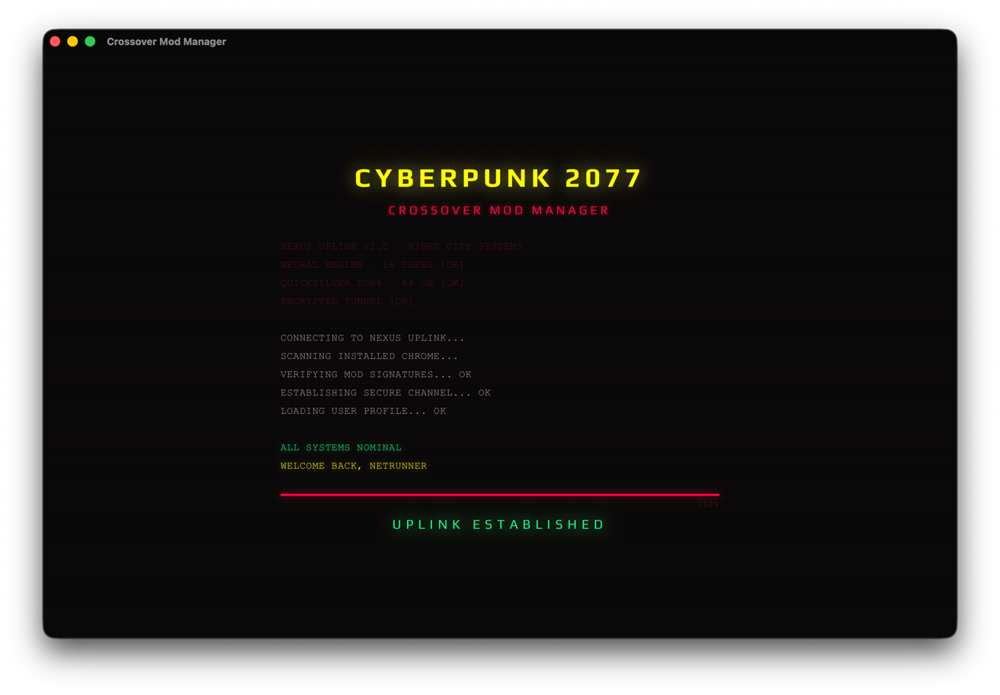
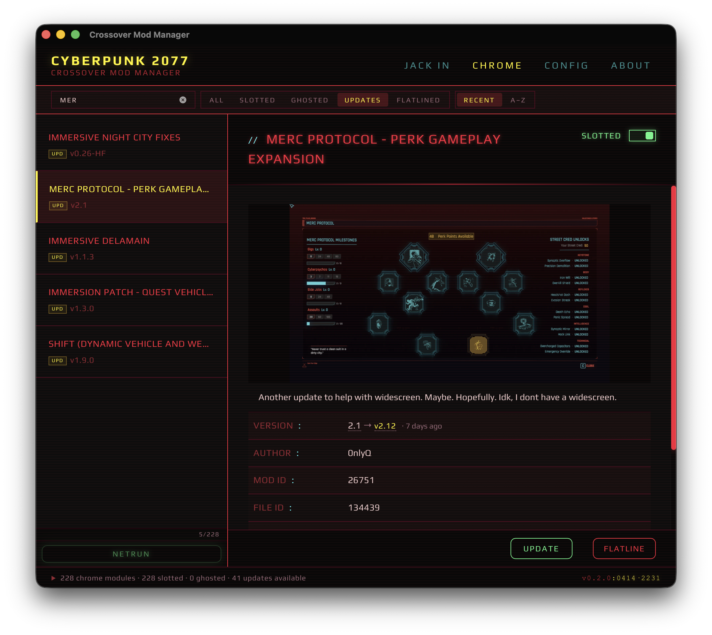
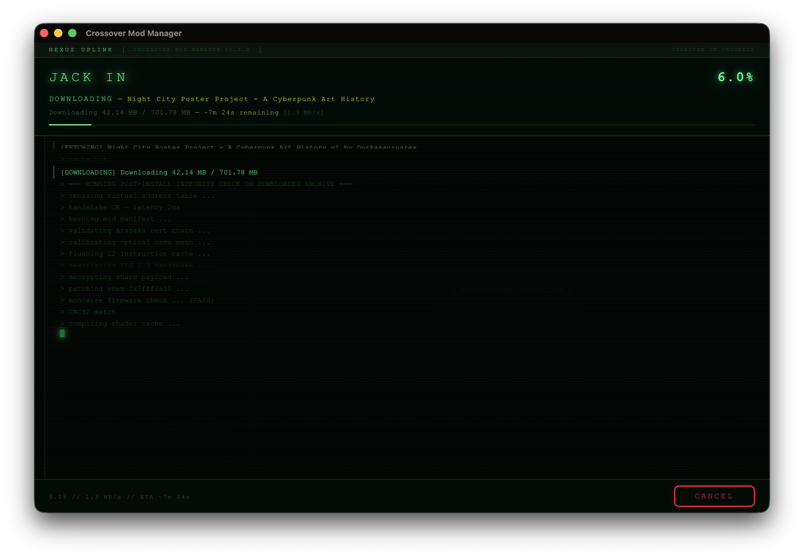
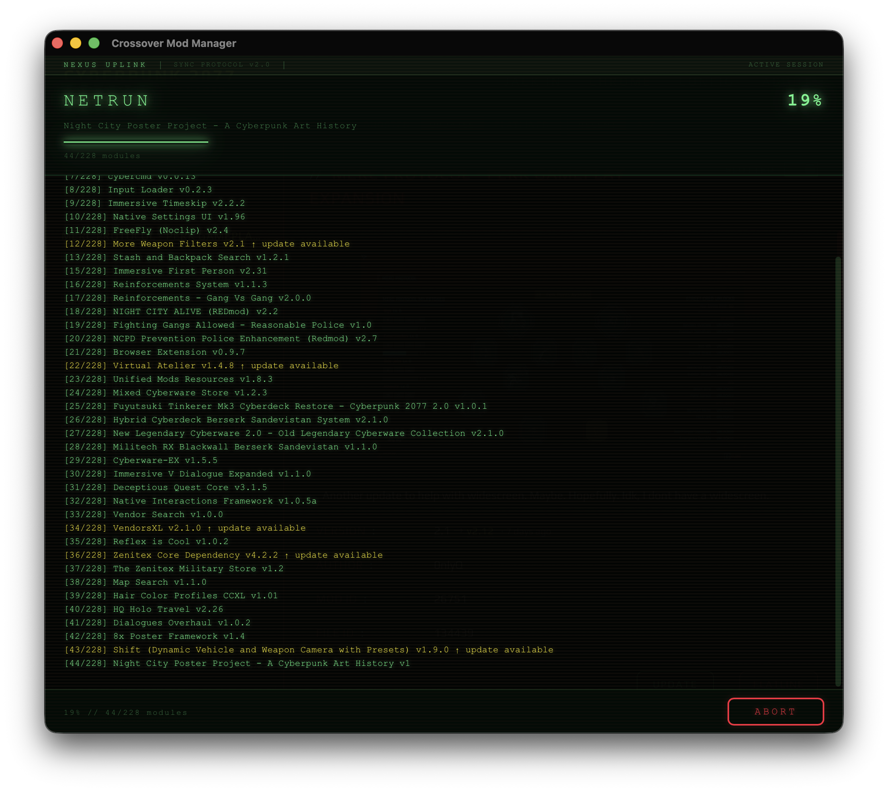

# Crossover Mod Manager — Cyberpunk 2077 Edition

Mod manager for Cyberpunk 2077 running via CrossOver on macOS.

Enjoy Night City, choom!









## What's New in 1.1

- **Database backup/restore** — create, restore, and delete backups of mod database from Config page
- **Mod file validation** — scan all mods, verify files exist on disk
- **CONFIG page** — cleaned up, removed test buttons, removed unused settings

## What's New in 1.0

- **Cyberpunk 2077 UI** — full redesign styled after the game aesthetic, themed vocabulary throughout
- **Mod lifecycle** — install, update, reinstall, and remove mods via NXM deep-link handler ("Download with Mod Manager")
- **Enable/Disable** — toggle mods on/off without removing; soft-delete with history
- **Mod details** — thumbnails, descriptions, version info, changelogs, per-file data from Nexus API
- **Multi-part mods** — parts grouped by Nexus Mod ID with summary and per-file views
- **Search, filter, sort** — search installed mods, filter by status, sort by name or install date
- **Sync with NexusMods** — fetch metadata, check for updates, per-file descriptions and images
- **Startup checks** — auto-detect game path, verify permissions, API key, NXM URL handler
- **Path safety** — traversal protection and game directory validation on all file operations
- **Error handling** — verbose logging, conflict detection, detailed status messages

## Requirements

- macOS 11.0+ (Apple Silicon)
- [CrossOver](https://www.codeweavers.com/crossover) 25+
- Cyberpunk 2077 installed in a CrossOver bottle
- [NexusMods](https://www.nexusmods.com) account (for API key and downloads)

## Download

Download the latest release from the [Releases](https://github.com/wackyfrog/cp2077-crossover-mod-manager/releases) page.

**First launch on macOS**: Right-click the app → Open → Open (bypasses Gatekeeper for unsigned apps).

## Quick Start

1. Launch the app
2. Go to **Config** → set your Cyberpunk 2077 game path
3. Add your NexusMods API key (get one at [nexusmods.com/users/myaccount?tab=api+access](https://www.nexusmods.com/users/myaccount?tab=api+access))
4. Visit NexusMods → click "Download with Mod Manager" on any CP2077 mod
5. The app handles everything: download, extract, install, track

## Building from Source

```bash
git clone https://github.com/wackyfrog/cp2077-crossover-mod-manager.git
cd cp2077-crossover-mod-manager
npm install
npm run tauri:dev    # development
npm run tauri:build  # production
```

Requires: Node.js 18+, Rust 1.70+, Xcode Command Line Tools.

Optional (faster extraction): `brew install p7zip unrar`

## Tech Stack

- **Frontend**: React 19 + Vite 7
- **Backend**: Tauri 2 + Rust

## Data Storage

All data stored in `~/.crossover-mod-manager/`:
- `mods.json` — installed mods database
- `settings.json` — app settings and API key

Uninstalling the app does **not** remove mods from the game directory.

## Credits

- Original project: [Crossover Mod Manager](https://github.com/beneccles/crossover-mod-manager) by Benjamin Eccles
- Built with [Claude](https://claude.ai) by Anthropic

## License

MIT
