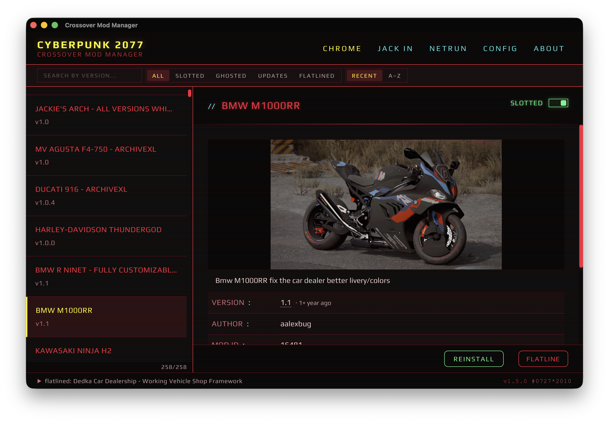
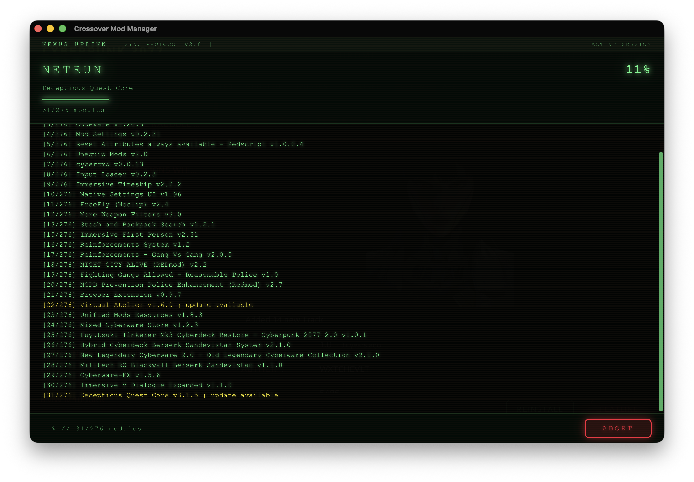
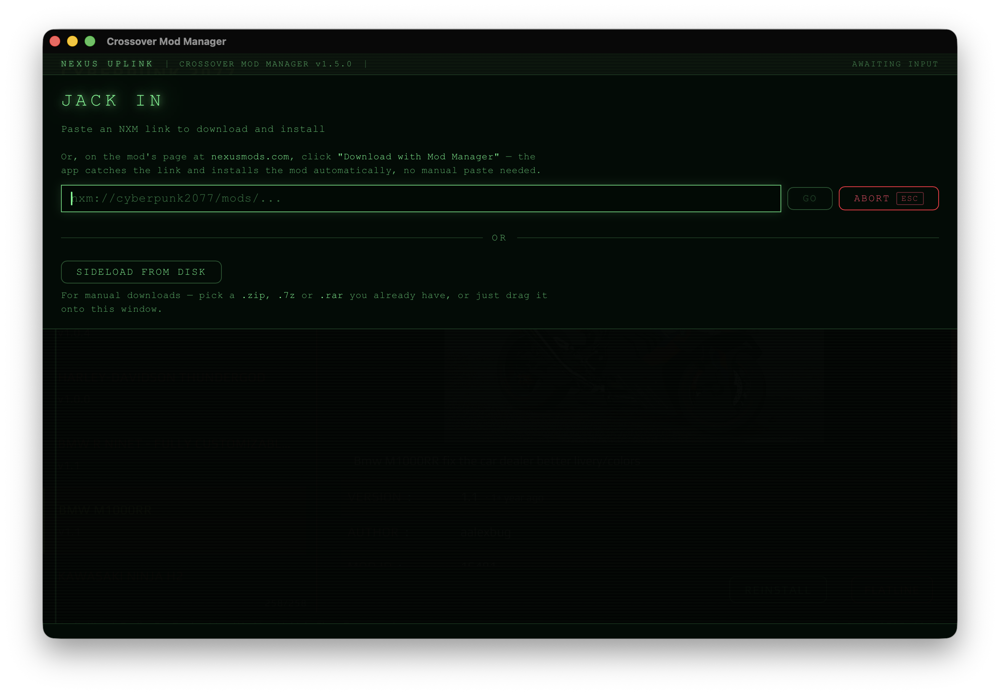
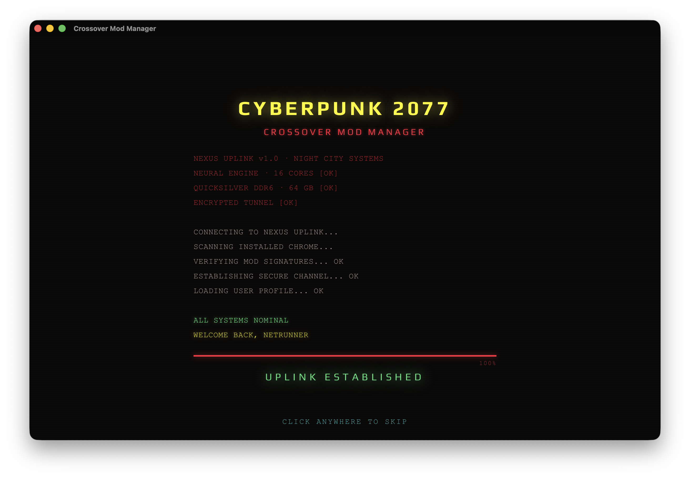
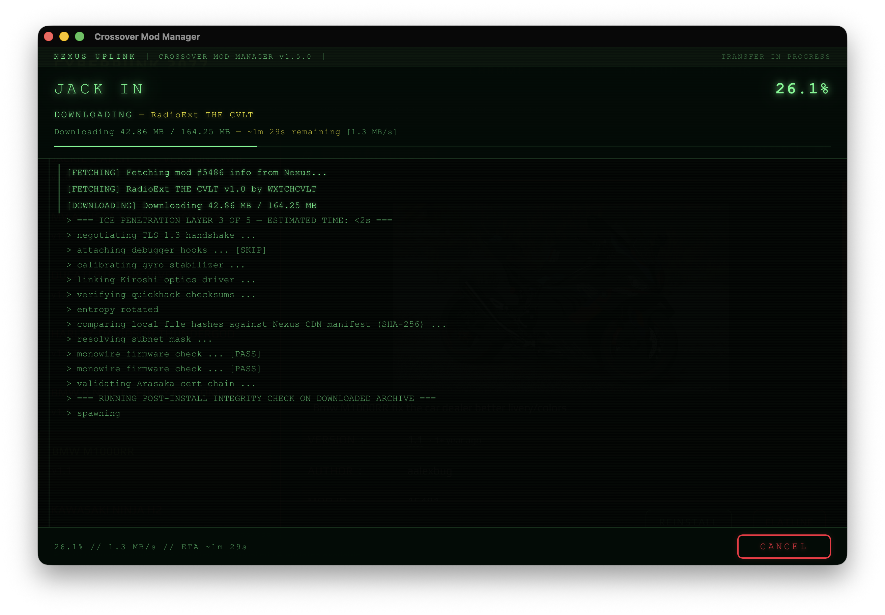
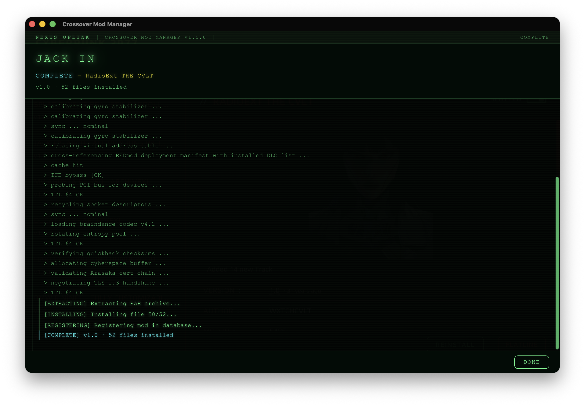

# Crossover Mod Manager — Cyberpunk 2077 Edition

[](https://github.com/wackyfrog/cp2077-crossover-mod-manager/releases/latest)
[](#requirements)
[](https://www.codeweavers.com/crossover)
[](LICENSE)

Mod manager for Cyberpunk 2077 running via CrossOver on macOS.

**[wackyfrog.github.io/cp2077-crossover-mod-manager](https://wackyfrog.github.io/cp2077-crossover-mod-manager/)** — the short version, if you would rather not read all of this.

Enjoy Night City, choom!

## Contents

- [Screenshots](#screenshots)
- [Mods that show as enabled but do nothing](#mods-that-show-as-enabled-but-do-nothing) — and how to repair them
- [Housekeeping](#housekeeping) — clutter earlier versions could leave behind
- [What's new](#whats-new-in-15)
- [Requirements](#requirements) · [Download](#download) · [Quick start](#quick-start)
- [Building from source](#building-from-source) · [Tech stack](#tech-stack) · [Data storage](#data-storage)

## Screenshots

<table>
<tr>
<td width="50%"></td>
<td width="50%"></td>
</tr>
<tr>
<td><b>Chrome</b> — the mod list, with details, versions and update alerts</td>
<td><b>Netrun</b> — fetch metadata and check for updates</td>
</tr>
<tr>
<td></td>
<td></td>
</tr>
<tr>
<td><b>Jack In</b> — paste an NXM link, or sideload an archive from disk</td>
<td><b>Splash</b> — click anywhere to skip</td>
</tr>
</table>

<details>
<summary><b>Jack In, while it works</b> — download progress and the finished install</summary>

<table>
<tr>
<td width="50%"></td>
<td width="50%"></td>
</tr>
</table>

</details>

## Mods that show as enabled but do nothing

Two separate defects could put a mod's files somewhere no mod loader looks.
Both are fixed for new installs, but files already on disk stay where they
were put until you repair them. Neither produces an error anywhere: the files
were really copied, the mod is recorded, the toggle says enabled — and the
loaders simply never see them.

If a mod isn't working and you used an earlier version, run **Config →
Maintenance** and check both scans below. They only report; nothing changes
until you press Repair.

### Wrapper folders (versions up to 1.2)

It affects mods that were installed successfully, show up as enabled, and
still do nothing in the game.

**What went wrong.** Mods are usually packaged with the game's own folder
layout inside the archive (`archive/`, `bin/`, `r6/`…), and those get merged
into the game directory. But some mods ship everything inside one extra folder
named after the mod:

```
the archive:            installed as (wrong):        should have been:
ModName/                {game}/ModName/r6/…          {game}/r6/…
  r6/tweaks/…           {game}/ModName/bin/…         {game}/bin/…
  bin/x64/…
```

Versions up to 1.2 copied that layout verbatim, wrapper and all. Nothing looks
wrong from the app's side — the files really were copied, the mod is recorded,
the toggle says enabled — but no mod loader looks inside `{game}/ModName/`, so
the mod never loads. There is no error anywhere: CET and TweakXL don't report
folders they were never told about.

**Whether it hit you** depends on what the mod is made of. The installer had
fallback rules for `.archive`, `.reds`, `.dll` and `.exe` files, which quietly
rescued those. Everything else — the `.lua` and `.json` of CET mods, the
`.yaml` of TweakXL tweaks, loose textures — fell through and stayed in the
wrapper. In a real 262-mod library, 2 mods were affected.

**How to check and fix it**, in v1.3 or later:

1. The startup banner tells you if anything is affected: *"N mods installed
   inside a redundant folder and can't be loaded by the game"*.
2. **Config → Check for unloadable mods** lists exactly what would move,
   without changing anything yet.
3. **Repair now** backs up the mod database, moves each file to where the
   loaders actually look, updates the database, and clears the emptied folders.
4. Restart the game.

Repair is deliberately cautious and skips anything ambiguous: multi-variant and
FOMOD archives (moving their parts would enable options you never chose), and
mods whose top-level folder holds no recognisable game directory. If a file's
destination is already taken by another mod, it is skipped rather than
overwritten. Reinstalling a mod also fixes it, since new installs strip the
wrapper correctly.

A mod can also land *half* in a wrapper: some files where they belong, the rest
under a folder no loader reads. The scan lists these separately, because that
shape on disk is indistinguishable from a mod whose base files installed
correctly next to an optional variant you never selected. **Repair now** leaves
them alone; each gets its own button, since moving the files activates whatever
they contain and only you know which it is. Check the mod's page first.

### Archives packed on Windows (versions up to 1.4)

Some archives store their entries with backslashes: `r6\scripts\Mod\file.reds`
instead of `r6/scripts/Mod/file.reds`. On Windows those are folder separators.
On macOS a backslash is an ordinary character in a filename, so the whole path
became the *name* of one file sitting loose in the game folder, and the folders
it spells out were never created:

```
the archive:                     installed as (wrong):              should have been:
r6\scripts\Mod\file.reds         {game}/r6\scripts\Mod\file.reds    {game}/r6/scripts/Mod/file.reds
                                 (one file, backslashes in name)
```

This one is harder to notice than the wrapper case, because **"Validate mod
files" calls the file present** — it does exist, at exactly the path recorded
for it. Only the loader disagrees.

**How to check and fix it**, in v1.5 or later:

1. The startup banner reports it: *"N mods have M files stored under a
   Windows-style path the game can't follow"*.
2. **Config → Check for scrambled file paths** shows where each file would go.
3. **Repair now** backs up the database, rebuilds the folder structure, and
   updates the records. Then restart the game.

In a real 262-mod library, 1 mod was affected. Reinstalling also fixes it.

## Housekeeping

Clutter earlier versions could leave behind. None of this breaks the game — it
wastes space and produces warnings that look like breakage. Versions up to 1.4
could leave three kinds of leftovers:

- **Files of deleted mods.** Deleting a *switched-off* mod deleted nothing at
  all: its files live under a `.disabled` suffix while unslotted, and removal
  only looked for the active names. The mod vanished from the list while every
  file stayed on disk, now untracked. One library had 18 working `.lua` files
  left over from a single mod this way.
- **Empty mod folders.** Removing a mod left its folders standing, and Cyber
  Engine Tweaks logs *"Ignoring mod which does not contain init.lua!"* for each
  one at every launch. Folders also survive because CET writes its own
  `db.sqlite3`, logs and settings into them — files no mod's manifest knows about.
- **Loose files in the game root.** Some archives ship readmes, `fomod/` option
  trees, or texture folders that no loader reads; those land in the game
  directory alongside the real files.

**To clean up**, in v1.5 or later, under **Config → Maintenance**:

- **Validate mod files** — reports files that are missing, and files that are
  on disk but in the wrong state (a slotted mod whose files are ghosted does
  nothing; an unslotted one whose files are active runs anyway)
- **Check for leftover mod folders** — lists CET folders that hold no mod any
  more, with what each contains and how big it is, and lets you pick. Folders
  holding settings start unchecked, and a folder containing files that belong
  to an *installed* mod is never listed — mods do ship presets for one another
- **Remove duplicate records** and **Clean temporary files** — database
  duplicates and leftover extraction directories in `/tmp`

Deleting a mod through the app now clears the folders it empties, so this is
mostly about tidying what earlier versions left.

## What's New in 1.5

- **Mods from archives packed on Windows now install into real folders** — backslash paths used to become one long filename that no loader could find, while every check reported the file as present. **Config → Check for scrambled file paths** repairs mods already installed that way. Archives can also no longer write outside the folder they're unpacked into
- **The Jack In screen keeps track of what's running** — after any failure it used to stay on FAULT DETECTED for good, with a live Retry button that would resubmit the *previous* mod and blank out the running download's name, so the next click cancelled it. A failed install with the screen closed showed an empty prompt instead of the error, and dropping a second archive after a failed one was silently refused. All fixed; a download turned away while another is running now says so on screen instead of behind the overlay
- **Switched-off mods are handled properly everywhere** — an unslotted mod keeps its files on disk under a `.disabled` suffix, and three places in the app didn't know that. Deleting such a mod deleted nothing while still marking it removed, leaving its files stranded; "Validate mod files" reported every unslotted mod's files as missing (one install showed *910 missing files* with nothing missing at all)
- **Check for leftover mod folders** (Config) — Cyber Engine Tweaks logs *"Ignoring mod which does not contain init.lua!"* for every folder that no longer holds a mod, which reads as breakage but isn't. Removal now clears the folders it empties, and this scan finds older leftovers — showing what each holds so you can decide. Folders with settings in them, or holding files that belong to an installed mod, are never swept
- **Validation now flags files in the wrong state** — a slotted mod whose files are ghosted does nothing in the game, and an unslotted one whose files are active runs anyway. Neither is a missing file, and nothing else would tell you

<details>
<summary><b>Earlier releases</b> — 1.4, 1.3, 1.2, 1.1, 1.0</summary>

### What's New in 1.4

- **Reworked navigation** — menu order is now Chrome / Jack In / Netrun / Config / About. **Netrun** moved up into the main menu, and **Sideload** moved into the **Jack In** screen alongside the NXM link field, since both are ways to install a mod
- **Much easier to read** — larger text throughout and a big lift in contrast. The dim red on mod versions measured 2.44:1 against the background, far below what body text needs; that and the washed-out overlay text have been fixed. Borders and glows are untouched, so the look stays the same
- **Escape works** — previously it only did anything while a text field had focus. It now closes whatever is in front, from anywhere, and clears the mod search when nothing is open. It's ignored mid-install and mid-sync so you can't hide work that's still running
- **Clearer way out** — the exit button in Jack In and Netrun no longer looks like every other button on the screen, and shows an `esc` hint
- **Splash screen** — click anywhere to skip, and it's a quarter shorter

### What's New in 1.3

- **Sideload** — install a mod from a `.zip`/`.7z`/`.rar` on disk, for the many NexusMods pages that offer no "Download with Mod Manager" button. Pick it from **Jack In**, or drag the archive onto the window; details are read from the filename for you to confirm
- **Wrapper-folder fix** — see the section above, plus a repair tool for installs already affected
- **One install at a time** — a second "Download with Mod Manager" click, or an archive dropped mid-download, no longer starts a second install on top of the first
- **Legibility pass** — larger text throughout and much higher contrast, especially the dim reds that were hard to read on the dark background
- **Escape works everywhere** — it used to do nothing unless a text field had focus. Splash screen can be skipped with a click, and is a quarter shorter

### What's New in 1.2

- **Reliable game-path detection** — Auto-Detect scans every CrossOver bottle (Steam / GOG / Epic / custom) and lets you pick the right one when several are found
- **Mod relocation** — changing the game path offers to move (or copy) already-installed mods to the new location, so nothing is left behind
- **Install safety** — refuses to install into a path that isn't a real Cyberpunk 2077 folder, and fails loudly instead of reporting a phantom install with no files
- **Persistent self-check** — a dismissible banner surfaces game-path / permission / API-key / NXM-handler issues at startup
- **Shareable logs** — activity is mirrored to `~/.crossover-mod-manager/logs/app.log` with **Copy** and **Show in Finder** buttons for easy bug reports
- **Docs** — new [Setup & Troubleshooting](SETUP_AND_TROUBLESHOOTING.md) guide

### What's New in 1.1

- **Auto-sync after install** — picture, summary, and file descriptions fetched from Nexus API immediately after install/update, no manual Netrun needed
- **Database backup/restore** — create, restore, and delete backups of mod database from Config page
- **Mod file validation** — scan all mods, verify files exist on disk
- **CONFIG page** — cleaned up, removed test buttons, removed unused settings
- **Smarter updates** — ghosted (disabled) mods stay ghosted after an update; same file with a different version is treated as an update, not an error
- **Fixes** — filter no longer resets after updating a mod, mod details refresh correctly, correct sub-mod selected after install/update

### What's New in 1.0

- **Cyberpunk 2077 UI** — full redesign styled after the game aesthetic, themed vocabulary throughout
- **Mod lifecycle** — install, update, reinstall, and remove mods via NXM deep-link handler ("Download with Mod Manager")
- **Enable/Disable** — toggle mods on/off without removing; soft-delete with history
- **Mod details** — thumbnails, descriptions, version info, changelogs, per-file data from Nexus API
- **Multi-part mods** — parts grouped by Nexus Mod ID with summary and per-file views
- **Search, filter, sort** — search installed mods, filter by status, sort by name or install date
- **Sync with NexusMods** — fetch metadata, check for updates, per-file descriptions and images
- **Startup checks** — auto-detect game path, verify permissions, API key, NXM URL handler
- **Path safety** — traversal protection and game directory validation on all file operations
- **Error handling** — verbose logging, conflict detection, detailed status messages

</details>

Full history in the [CHANGELOG](CHANGELOG.md).

## Requirements

- macOS 11.0+ (Apple Silicon)
- [CrossOver](https://www.codeweavers.com/crossover) 25+
- Cyberpunk 2077 installed in a CrossOver bottle
- [NexusMods](https://www.nexusmods.com) account (for API key and downloads)

## Download

Download the latest release from the [Releases](https://github.com/wackyfrog/cp2077-crossover-mod-manager/releases) page, or from the [project page](https://wackyfrog.github.io/cp2077-crossover-mod-manager/).

<a id="first-launch-on-macos"></a>
### First launch on macOS

The app is **ad-hoc signed and not notarized** — there is no paid Apple Developer account behind this project. macOS therefore blocks it the first time, with a message about an unidentified developer or a damaged app. Nothing is actually wrong with the download; the app simply has no Apple-issued signature for Gatekeeper to check.

Anything you download through a browser is tagged with a `com.apple.quarantine` attribute, and that tag is what triggers the check. Pick either route:

**System Settings (macOS 15 Sequoia and later)**

1. Try to open the app once and let it be blocked — this is what creates the entry to approve
2. **Apple menu → System Settings → Privacy & Security**
3. Scroll to **Security**, find the message about the blocked app, click **Open Anyway** (available for about an hour after the blocked attempt)
4. Enter your login password

The app is then saved as an exception and opens normally from that point on.

**Terminal (any macOS version)**

```bash
xattr -dr com.apple.quarantine "/Applications/Crossover Mod Manager.app"
```

This strips the quarantine tag, after which the app launches like any other.

> **Control-click → Open no longer works on macOS 15+.** Apple removed that bypass: *"In macOS Sequoia, users will no longer be able to Control-click to override Gatekeeper when opening software that isn't signed correctly or notarized. They'll need to visit System Settings > Privacy & Security to review security information for software before allowing it to run."* — [Updates to runtime protection in macOS Sequoia](https://developer.apple.com/news/?id=saqachfa) (Apple Developer, 6 Aug 2024). On macOS 14 and earlier, Control-click → Open still works.

Apple's own instructions: [Open a Mac app from an unknown developer](https://support.apple.com/guide/mac-help/open-a-mac-app-from-an-unknown-developer-mh40616/mac).

Notarizing would remove this step entirely, but it requires membership in the [Apple Developer Program](https://developer.apple.com/programs/) ($99/year). If you would rather not take the app on trust, build it yourself from source — see [DEVELOPMENT.md](DEVELOPMENT.md).

## Quick Start

1. Launch the app
2. Go to **Config** → set your Cyberpunk 2077 game path
3. Add your NexusMods API key (get one at [nexusmods.com/users/myaccount?tab=api+access](https://www.nexusmods.com/users/myaccount?tab=api+access))
4. Visit NexusMods → click "Download with Mod Manager" on any CP2077 mod
5. The app handles everything: download, extract, install, track

No "Download with Mod Manager" button on the mod's page? Download the archive
yourself, then use **Jack In → Sideload from disk** (or just drag the `.zip` /
`.7z` / `.rar` onto the window).

> **Mods not showing up in the game?** Two things to check:
> - If you installed them with an earlier version, see
>   [mods that show as enabled but do nothing](#mods-that-show-as-enabled-but-do-nothing)
>   above — the app can find and repair both causes.
> - Otherwise the usual cause is a wrong game path:
>   **[Setup & Troubleshooting](SETUP_AND_TROUBLESHOOTING.md)** covers
>   step-by-step setup, verifying installs, and fixing the path.

## Building from Source

```bash
git clone https://github.com/wackyfrog/cp2077-crossover-mod-manager.git
cd cp2077-crossover-mod-manager
npm install
npm run tauri:dev    # development
npm run tauri:build  # production
```

Requires: Node.js 18+, Rust 1.70+, Xcode Command Line Tools.

Optional (faster extraction): `brew install p7zip unrar`

**Tests** cover the parts where a mistake is silent — archive extraction and
path handling, install-path resolution, the repair and cleanup passes, and
removal of switched-off mods:

```bash
cd src-tauri && cargo test
```

## Tech Stack

- **Frontend**: React 19 + Vite 7
- **Backend**: Tauri 2 + Rust

## Data Storage

All data stored in `~/.crossover-mod-manager/`:
- `mods.json` — installed mods database
- `settings.json` — app settings and API key

Uninstalling the app does **not** remove mods from the game directory.

## Credits

- Original project: [Crossover Mod Manager](https://github.com/beneccles/crossover-mod-manager) by Benjamin Eccles
- Built with [Claude](https://claude.ai) by Anthropic

## License

MIT
